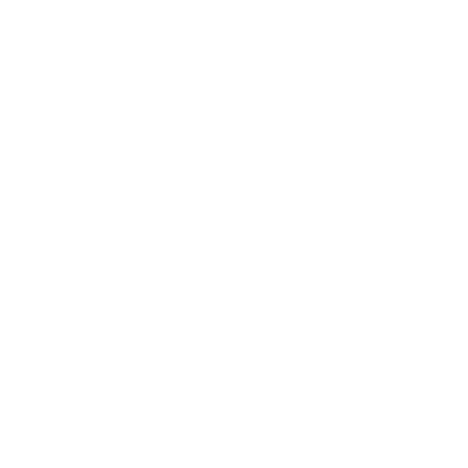

# Build settings
theme: minima

<!DOCTYPE html>
<html lang="en">
<head>
    <title>Welcome to the Allison Lab</title>
    <meta name="description" content="Home Page">
    <meta name="keywords" content="Allison Lab, University of Canterbury, New Zealand, NZ">
    <meta name="author" content="Viet-Anh Hoang">
    <meta charset="utf-8">
    <meta name="viewport" content="width=device-width, initial-scale=1.0">
    <link rel="shortcut icon" href="Images/Lab_Icon.ico">
    <link rel="stylesheet" href="CSS/NavBar.css">
    <link rel="stylesheet" href="CSS/Banner.css">
    <link rel="stylesheet" href="CSS/Content_Home_Pg.css">
    <link rel="stylesheet" href="CSS/Footer.css">
    
</head>

<body>
    

        

        

        

    

    

        
&times;

        

            
            <a id="sidenav_link1">Research&#128898</a>
            

                <a class="dropdown_link" href="Themes & Technologies.html">&#8226; Research themes & technologies</a>
                <a class="dropdown_link" href="ScientificOutputs.html">&#8226; Scientific outputs</a>
            

            <a id="sidenav_link2" href="Team.html">Team</a>
            <a id="sidenav_link3" href="Facilities.html">Facilities</a>
            <a id="sidenav_link4" href="Opportunities.html">Opportunities</a>
        

        

            <a id="sidenav_link5" href="Contacts-Address-Access.html">
                
Contacts

                &#8212;&#8212;&#8212;&#8212;&#8212;
                
Address

                &#8212;&#8212;&#8212;&#8212;&#8212;
                
Access

            </a>
            <a id="sidenav_link6" href="Copyright.html">Copyright</a>
        

    

    
    

        <ul id="topnavbar">
            <li></li>
            <ul>
                <li>
                    

                        <a class="link" href="Research.html">Research</a>
                        

                            
                            <a class="sub_link" href="Themes & Technologies.html">Themes & technologies</a>
                            

                            <a class="sub_link" href="ScientificOutputs.html">Scientific outputs</a>
                        

                    

                </li>
                <li>
<a class="link" href="Team.html">Team</a>
</li>
                <li>
<a class="link" href="Facilities.html">Facilities</a>
</li>
                <li>
<a class="link" href="Opportunities.html">Opportunities</a>
</li>
            </ul>
        </ul>

        <section id="banner">
            
            
            
            
            
            
            
            
            
            
            
Home

            

                <h1>Welcome to the Allison Lab!</h1>
                
The Allison Laboratory, a part of the School of Physical and Chemical Sciencies, University of Canterbury and Biomolecular Interaction Centre, is a structural and functional biochemistry research group located in Christchurch, the gateway to the South Island of New Zealand.
                      
                    <a class="intro_button" href="Team.html">Our team</a>
                    <a class="intro_button" href="Research.html">Our research</a>
                

            

        </section>

        <section id="intro_mobile">
            <h2>Welcome to the Allison Lab!</h2>
            
The Allison Laboratory, a part of the School of Physical and Chemical Sciencies, University of Canterbury and Biomolecular Interaction Centre, is a structural and functional biochemistry research group located in Christchurch, the gateway to the South Island of New Zealand.
                  
                <a class="intro_button" href="Team.html">Our team</a>
                <a class="intro_button" href="Research.html">Our research</a>
            

        </section>

        <section id="news">
            <h2>News</h2>
            

                <a href="#" id="col1" class="scrolling_animation">
                    
                    
Vivamus venenatis velit nec neque ultricies, eget elementum magna tristique.  April 15, 2022

                </a>
                

                    <a class="row scrolling_animation" href="#">
                        
                        
Vivamus venenatis velit nec neque ultricies, eget elementum magna tristique.  April 15, 2022

                    </a>
                    <a class="row scrolling_animation" href="#">
                        
                        
Vivamus venenatis velit nec neque ultricies, eget elementum magna tristique.  April 15, 2022

                    </a>
                    <a class="row scrolling_animation" href="#">
                        
                        
Vivamus venenatis velit nec neque ultricies, eget elementum magna tristique.  April 15, 2022

                    </a>
                

            

        </section>

        <section id="pub_n_tweet">
            

                <h2>Recent publications</h2>
                

                    
Ion mobility-mass spectrometry shows stepwise protein unfolding under alkaline conditions
2021Journal Articles
                    
Sahin C., Österlund N., Leppert A., Johansson J., Marklund EG., Benesch JLP., Ilag LL., Allison TM. and Landreh M.

                    
<b>Chemical Communications</b> 57(12): 1450-1453

                    <a class="ref_link" href="http://dx.doi.org/10.1039/d0cc08135c">http://dx.doi.org/10.1039/d0cc08135c</a>
                

                

                    
Native Protein Mass Spectrometry
2020Chapters
                    
Allison TM. and Agasid MT.

                    
<b>Methods in Molecular Biology</b>: 287-299

                    <a class="ref_link" href="http://dx.doi.org/10.1007/978-1-4939-9869-2_15">http://dx.doi.org/10.1007/978-1-4939-9869-2_15</a>
                

                

                    
Software requirements for the analysis and interpretation of native ion mobility mass spectrometry data
2020Journal Articles
                    
Allison TM., Barran P., Benesch JLP., Cianferani S., Degiacomi MT., Gabelica V., Grandori R., Marklund EG., Menneteau T. and Migas LG.

                    
<b>Analytical Chemistry</b> 92(16): 10881-10890

                    <a class="ref_link" href="http://dx.doi.org/10.1021/acs.analchem.9b05792">http://dx.doi.org/10.1021/acs.analchem.9b05792</a>
                

                

                    
Computational strategies and challenges for using native ion mobility mass spectrometry in biophysics and structural biology
2020Journal Articles
                    
Allison TM., Barran P., Cianférani S., Degiacomi MT., Gabelica V., Grandori R., Marklund EG., Menneteau T., Migas LG. and Politis A.

                    
<b>Analytical Chemistry</b> 92(16): 10872-10880

                    <a class="ref_link" href="http://dx.doi.org/10.1021/acs.analchem.9b05791">http://dx.doi.org/10.1021/acs.analchem.9b05791</a>
                

                

                    
A mass-spectrometry-based approach to distinguish annular and specific lipid binding to membrane proteins
2020Journal Articles
                    
Bolla JR., Corey RA., Sahin C., Gault J., Hummer A., Hopper JTS., Lane DP., Drew D., Allison TM. and Stansfeld PJ.

                    
<b>Angewandte Chemie - International Edition</b> 59(9): 3523-3528

                    <a class="ref_link" href="http://dx.doi.org/10.1002/anie.201914411">http://dx.doi.org/10.1002/anie.201914411</a>
                

                <a class="button" href="Publications.html">All publications</a>   <!--added 2   to equal heights of col3 & col4 since <a> is inline block then no padding counts-->
            

            

                <a class="twitter-timeline" data-height="auto" data-theme="light" data-chrome="transparent" data-border-color="#c0c0c0" href="https://twitter.com/allison_lab?ref_src=twsrc%5Etfw">Tweets by allison_lab</a> 
            

        </section>

        <section id="footer">
            

                
                

                    

                        <a class="link" href="Contacts-Address-Access.html">Contacts</a>
                        -
                        <a class="link" href="Contacts-Address-Access.html">Address</a>
                        -
                        <a class="link" href="Contacts-Address-Access.html">Access</a>
                    

                    
<a class="link" href="Copyright.html">Copyright</a>

                    
|

                

                
            

            

                
<a class="link" href="Copyright.html">2017-2021 Allison Lab</a>

                

                    <a class="link" href="tel:+64 (3) 369 3034">+64 (3) 369 3034</a>
                    |
                    <a class="link" href="mailto:timothy.allison@canterbury.ac.nz">timothy.allison@canterbury.ac.nz</a>
                

                
<a class="link" href="Contacts-Address-Access.html">School of Physical and Chemical Sciences, University of Canterbury, Private Bag 4800, Christchurch 8140, New Zealand</a>

            

        </section>

        <a id="jump_link" class="anchor hide" href="#topnavbar">
            
&#11165;

        </a>

        
        
        
    

</body>
</html>
